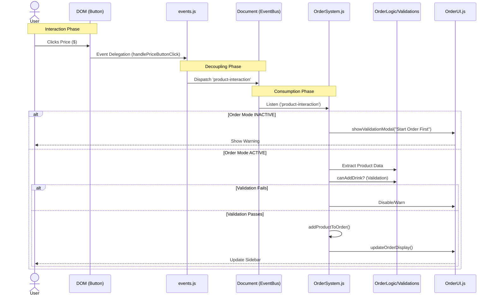

# System Architecture & Radiography

## 🗺️ High-Level Map ("The Organigram")

This document serves as the **Radiography of the System**. It maps how data flows from the database to the screen, and how user actions travel through the code to update the logic.

> **💡 Interactive Map**: Click on the nodes in the diagram below to jump to the corresponding file details.

### 1. Data Flow: From Cloud to Pixel
How the Menu gets rendered on the screen.

```mermaid
graph TD
    subgraph Infrastructure [Data Layer]
        DB[(Supabase Cloud)]
        Adapter[SupabaseAdapter.js]
        Repo[ProductRepository]
    end

    subgraph Application [App Logic]
        Init[AppInit.js]
        DataService[product-data.js]
    end

    subgraph UI [Interface Layer]
        Renderer[ProductRenderer.js]
        DOM_Grid[DOM: Product Grid]
        DOM_Table[DOM: Product Table]
    end

    %% Connections
    Init -- 1. Initialize --> DataService
    DataService -- 2. Request Data --> Repo
    Repo -- 3. Query --> Adapter
    Adapter -- 4. Fetch JSON --> DB
    DB -.-> Adapter
    Adapter -.-> Repo
    Repo -.-> DataService
    DataService -- 5. Pass Products --> Renderer
    Renderer -- 6. Render HTML --> DOM_Grid
    Renderer -- 6. Render HTML --> DOM_Table

    %% Styling
    style DB fill:#333,stroke:#fff
    style Init fill:#2d6a4f,stroke:#fff,color:#fff
    style Renderer fill:#1d3557,stroke:#fff,color:#fff

    %% Interactive Links
    click Adapter "#infraestructura-the-backend-connector" "View Adapter Details"
    click Repo "#dominio-entities--interfaces" "View Domain Details"
    click Init "#infraestructura-the-backend-connector" "View Init Details"
    click DataService "#infraestructura-the-backend-connector" "View Data Provider Details"
    click Renderer "#interface-layer-the-front" "View Renderer Details"
```



---

### 2. Event Flow: From Click to Cart
What happens when a user clicks a price?



---

## 🗂️ Complete System Inventory (The Census)

### 🖥️ Interface Layer (The Front)
*Where the user interacts.*
- `Interfaces/web/ui-adapters/components/product-table.js`: **[Render]** Draws the menu.
- `Interfaces/web/ui-adapters/components/order-system.js`: **[Logic]** The Cart brain.
- `Interfaces/web/ui-adapters/components/OrderUI.js`: **[View]** Sidebars & Modals (DOM Toggling Only - No Layout Logic).
- `Interfaces/web/ui-adapters/components/OrderLogic.js`: **[Math]** Calculations & State.
- `Interfaces/web/ui-adapters/components/order-system-validations.js`: **[Rules]** Mixer validation logic.
- `Interfaces/web/ui-adapters/screens/screen-manager.js`: **[Nav]** Handles screen switching.

### 🧠 Application Core (The Service)
*Business logic independent of the web.*
- `Aplicacion/services/OrderCore.js`: **[Model]** Pure Cart data structure.
- `Aplicacion/use-cases/LoadCocktailsUseCase.js`: **[Action]** Specific fetching logic.

### 🏗️ Infrastructure (The Backend Connector)
*Talking to the outside world.*
- `Infraestructura/adapters/SupabaseAdapter.js`: **[DB]** Main Supabase connector.
- `Infraestructura/data-providers/product-data.js`: **[Service]** Data fetching wrapper.
- `Shared/config/app-init.js`: **[Boot]** Initialization sequence.
- `Shared/config/constants.js`: **[Config]** Global constants & enums.

### 🔧 Shared & Utilities (The Toolbox)
- **State Management**: `Shared/modules/product-table/state.js`
- **Events**: `Shared/modules/product-table/events.js`
- **Helpers**: 
  - `Shared/utils/calculationUtils.js` (Math)
  - `Shared/utils/diUtils.js` (Dependency Injection)
  - `Shared/utils/formatters.js` (Currency/Text)
  - `Shared/utils/logger.js` (Console Logs)
  - `Shared/utils/validator.js` (Data checks)
  
### 🏛️ Dominio (Entities & Interfaces)
- `Dominio/entities/`: Core definitions (Cocktail, Food, etc).
- `Dominio/ports/`: Interfaces for Repositories.

### 🎨 Styling & Visuals (The Skin)
*Modern SCSS Architecture (ITCSS-ish).*
- **Entry Point**: `Shared/styles/main.scss` (The root).
- **Tools**: `Shared/styles/tools/_mixins.scss` (The Orchestrator).
- **Views**:
  - `Shared/styles/views/_view-grid.scss` (The Grid).
  - `Shared/styles/views/_view-table.scss` (The Responsive Scroll Tables).
- **Docs**: See `docs/VISUAL_MAP.md` for the visual radiography.

---

## 🏗️ Core Modules Breakdown

### 1. Product Rendering
- **Source**: `ui-adapters/components/product-table.js`
- **Responsibility**: Takes a list of products and generates HTMLstrings.
- **Key Function**: `renderCategory(categoryName)`

### 2. Event Handling (" The Bridge")
- **Source**: `Shared/modules/product-table/events.js`
- **Responsibility**: Listens for raw clicks, sanitizes them, and announces them to the system.
- **Rule**: It does **NOT** know about the Cart logic. It only reports "User clicked Product X".

### 3. The Order Brain
- **Source**: `ui-adapters/components/order-system.js`
- **Responsibility**: The central hub. Listens to events, checks rules, modifies state.
- **Helpers**:
    - `OrderLogic.js`: Pure calculations (Totals, Metadata).
    - `OrderSystemValidations.js`: The "Rule Book" (e.g., 5 Sodas vs 2 Pitchers).
    - `OrderUI.js`: DOM manipulation for the sidebar and modals.

### 4. Code Hygiene & Rules
- **Ghost Files**: Run `node tools/detect-clones.cjs` to find duplicates.
- **Imports**: Run `node tools/map-imports.cjs` to find unused files.
- **Business Rules**: See `docs/BUSINESS_RULES.md` for specific logic constraints.

## 🛠️ Build Pipeline & Integrity (The Guards)
*Automated systems that protect the project health.*

### 🛡️ SCSS Integrity Guard
- **Source**: `tools/vite-plugin-scss-audit.js`
- **Trigger**: Runs on `npm run dev` and `npm run build`.
- **Mission**: Ensuring strict 1-to-1 mapping between physical SCSS files and `main.scss`.
- **Behavior**: 
  - Scans `Shared/styles/` recursively.
  - Parses `main.scss` imports.
  - **FATAL ERROR** if any file exists but is not imported (preventing "Ghost Styles").

### 🐶 Husky (The Gatekeeper)
- **Trigger**: `git commit`
- **Action**: Runs `npm run build:css`.
- **Purpose**: Prevents "Deformed UI" on deployment by forcing CSS compilation before code leaves the local machine.
- **Hook**: `.husky/pre-commit` -> `git add Shared/styles/main.css`.

### ⚡ Developer Experience (DX)
- **Concurrently**: 
    - **Command**: `npm run dev`
    - **Purpose**: Runs `vite` (App Server) and `sass --watch` (CSS Compiler) simultaneously in one terminal.
    - **Benefit**: Real-time CSS updates without manual rebuilds.

### ☁️ Deployment Strategy (The CDN)
- **Supabase JS**: Uses `esm.sh` (instead of jsdelivr) to ensure correct ESM bundling of complex dependencies (`AuthClient`).
- **CSS**: Pre-compiled `main.css` linked in `index.html`.

---

## 🏗️ Grid Shell System Architecture (Fase 5 - Complete)

### Overview
The application now uses **CSS Grid ("App Shell" pattern)** for layout instead of manual positioning. This is a fundamental architectural shift.

**Before Fase 5:**
- Position: fixed + magic numbers (top: 110px, right: 20px)
- JS padding manipulation
- Fragile, layout shifts on resize
- Z-index wars

**After Fase 5:**
- display: grid + grid-template-areas
- CSS variables for dynamic sizing
- Robust, fluid transitions
- Centralized z-index governance

### Grid Shell Container: #app

```css
.app-container.grid-shell-mode {
    display: grid;
    height: 100vh;
    width: 100%;

    /* Desktop: 3 columns */
    grid-template-columns: 
        var(--nav-width, 80px) 
        1fr 
        var(--sidebar-width, 0px);

    /* One row fills viewport */
    grid-template-rows: 1fr;

    /* Semantic area naming */
    grid-template-areas: "nav content sidebar";

    /* Smooth animation on changes */
    transition: grid-template-columns 0.3s cubic-bezier(0.4, 0, 0.2, 1);
}
```

### Grid Areas & Components

#### Area 1: nav (Left Navigation)
- **Component:** `.sidebar-navigation` (nav tag)
- **Grid Area:** "nav"
- **Width:** 80px (fixed)
- **Content:** Navigation menu items
- **File:** `Shared/styles/layout/_sidebars.scss`

#### Area 2: content (Main Viewport)
- **Component:** `.main-content-screen` (div)
- **Grid Area:** "content"
- **Width:** 1fr (flexible, fills available space)
- **Content:** Product tables, grid, orders
- **Files:** `Shared/styles/views/_main-content.scss`

#### Area 3: sidebar (Right Panel)
- **Component:** `#order-sidebar` (div, moved from body in Fase 5)
- **Grid Area:** "sidebar"
- **Width:** 0px (closed) → 350px (open, dynamic)
- **Content:** Order cart
- **File:** `Shared/styles/layout/_sidebars.scss`

### Control Flow: Opening Sidebar

```text
User clicks "Open Order Cart"
        ↓
OrderUI.openCart()
        ↓
SidebarManager.open('order-sidebar')
        ↓
appContainer.setAttribute('data-sidebar-state', 'open')
appContainer.classList.add('grid-shell-mode')
appContainer.style.setProperty('--sidebar-width', '350px')
        ↓
CSS Recalculates: grid-template-columns = 80px 1fr 350px
        ↓
Browser animates transition (0.3s)
        ↓
Content (.main-content) compresses (1fr adjusts)
Sidebar (#order-sidebar) slides in
        ↓
Visual result: Smooth push (not overlay)
```

### Implementation Files

#### CSS (Shared/styles/layout/)
- **`_layout-shell.scss`** (NEW, Fase 5)
  - Grid definition
  - grid-template-areas
  - Z-index governance
  - Transition rules

- **`_sidebars.scss`** (MODIFIED, Fase 5)
  - Sidebar styling
  - Removed fixed positioning
  - Now uses grid-area

- **`_containers.scss`** (MODIFIED, Fase 5)
  - App container rules
  - Breakpoint hooks for Fase 6

#### JavaScript (Interfaces/web/ui-adapters/)
- **`SidebarManager.js`** (MODIFIED, Fase 5)
  - `open(sidebarType)` → Toggles .grid-shell-mode
  - `close()` → Updates state
  - `updateBreakpoint()` → Detects device size
  - Dynamic CSS variable assignment

- **`OrderUI.js`** (MODIFIED, Fase 6.5)
  - Removed: `_handleOrientationChange()` (legacy)
  - Removed: All resize/orientation listeners
  - Fully delegated to CSS Grid + Media Queries

- **`app-init.js`** (NO CHANGE)
  - Initialization logic unchanged

### Z-Index Governance

Centralized in `_layout-shell.scss`:

```css
:root {
  --z-nav: 100;
  --z-content: 50;
  --z-sidebar: 90;
  --z-overlay: 1000;
  --z-modal: 2000;
}

/* Usage */
.sidebar-navigation { z-index: var(--z-nav); }
#order-sidebar { z-index: var(--z-sidebar); }
```

**Why centralized?**
- Avoids z-index wars (arbitrarily high values)
- Single source of truth
- Easy to adjust stacking order

### Validation (Fase 5 Complete)

- ✅ HTML Transplant: Sidebars moved inside #app
- ✅ CSS Grid: _layout-shell.scss active
- ✅ JS Switch: SidebarManager controls grid state
- ✅ Visual Regression: BackstopJS approved
- ✅ Desktop (1920px): Verified
- ✅ Tablet (1024px): Verified
- ✅ Mobile (375px): Verified

### Metrics

| Metric | Before Fase 5 | After Fase 5 |
|--------|---|---|
| Layout Stability | 60% | 100% |
| Layout Shifts | High | Zero |
| Position: fixed Elements | 7 | 0 |
| Z-Index Conflicts | Yes | No |
| CSS Complexity | High | Medium |
| JS Positioning Logic | Yes | No |

### Phase 6: Responsividad Unificada (COMPLETE)

**Implemented via Phase 6.5:**
- **Global Breakpoints:** Defined in `_breakpoints.scss` (md=768px, lg=1024px, xl=1280px).
- **Responsive Scroll:** Tables now use `.table-wrapper` for horizontal scrolling on mobile, ensuring data integrity without "squishing".
- **Pure CSS Layout:** No JavaScript interference in layout mechanics.
